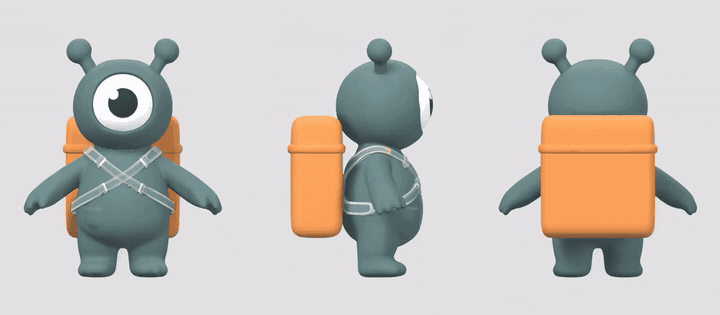
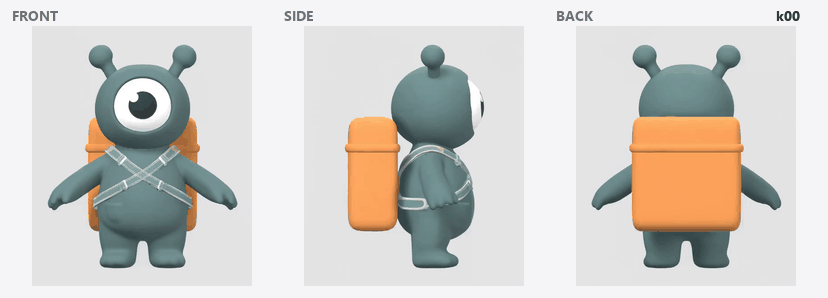

# From Mesh to Motion

Turn one rest-pose 3D mesh into a **keyframe sheet** an auto-rigging tool can animate from —
16 keyframes, three orthographic views each, all in register. It runs as **one ComfyUI graph**
plus a headless Blender pass.



<sub>One canvas, three orthographic views, animated in a single pass. Nothing enforces that the
panels agree — they agree because they are the same picture.</sub>

> **Everything here is a research demo.** The mascot, its mesh and its motion were generated for
> this repository and are released CC0. No client work, brand or likeness is involved, and every
> generated asset is machine-made.

**Full write-up:** [`docs/report/index.html`](docs/report/index.html) — the method, the failure
modes, and the numbers behind the consistency claims.

---

## What it does

An auto-rigger does not have to infer motion from a sentence. Give it a rigged mesh and a sheet of
keyframes drawn in orthographic views, and it reads the poses off the pictures instead.

Producing that sheet is the hard part. Asking an image model for `front`, then `side`, then `back`
is three independent requests, and they come back as three drawings of three slightly different
characters in three slightly different poses — by keyframe 12 the drift is not subtle. **This
repository produces the sheet without that contradiction**, leaving the rig and the final animation
to Astra, Meshy, or a human.

| Stage | What happens | Where |
|---|---|---|
| **0 · Mesh** | A concept image becomes a textured, A-posed GLB. Optional — bring your own mesh. | Cloud |
| **1 · Anchors** | Blender renders the rest pose from a *true* orthographic camera: front, side, back, one scale, one pivot. This is geometry, not generation. | Local |
| **2 · Triptych** | The three views are composited onto **one 21:9 canvas**. | Local |
| **3 · Motion** | Image-to-video animates that canvas. All three panels move *inside one frame*, so they stay in step by construction. | Cloud |
| **4 · Register** | Frame 0 is matched against the submitted canvas to recover however the model rescaled it. | Local |
| **5 · Sheet** | 16 frames sampled, panels cut apart, contact sheet + `keyframes.json` + `handoff.txt`. | Local |
| **6 · Rig & animate** | The sheet goes to Astra or Meshy with the rest-pose mesh. | Manual |

---

## The idea that makes it work

Three views of one pose have to agree with each other, or the rigging tool gets contradictory
instructions and splits the difference into mush.

The usual fix is to generate a view and then try to rotate it, which is a hard problem. This
pipeline sidesteps it: **it never generates a view on its own**. The three orthographic renders are
glued into a single image before the video model ever sees them, so the model is not animating
three characters — it is animating one picture that happens to contain three panels. Panels in one
frame share the model's attention, and they stay synchronised for free.



<sub>The sixteen keyframes that come out, stepped one at a time. These are the split panels, so
this is exactly what lands in the sheet.</sub>

Two details carry the weight:

**The anchors are rendered, not generated.** Blender rotates the *object* and never moves the
camera, so all three views share one ortho scale and one pivot to the pixel. A limb at a given
height in the front view is at that same height in the side view. Nothing downstream can restore
that property if it is not true at the start.

**The clip is registered before it is cut.** Video models do not return what they were given: the
1904×816 canvas came back as 1536×672, a 2.1% *non-uniform* rescale. Since frame 0 of an
image-to-video clip is very nearly the input image, the mapping is recovered from the two content
bounding boxes and applied to every frame.

This is insurance, not a rescue, and the numbers say so. Mean absolute error of the split panels
against the source, per 255:

| What the model returned | Split naively | Registered first |
|---|---|---|
| Rescaled — what MiniMax H3 actually did | **0.28** | 0.85 |
| Letterboxed into 16:9 | 18.35 | **0.89** |
| Centre-cropped by 6% | 20.19 | **0.54** |

For the clip this repo ran, a naive stretch was already fine — registration cost about half a point
of resampling error and fixed nothing. It earns its place on the providers that letterbox or crop,
where it is twenty times better, and it turns a silent 2% shear into a printed warning either way.
Regenerate the table with `python scripts/build_docs_assets.py`.

---

## Does it work on anything else?

The pipeline was built around one mascot, so two more characters were invented to attack it: a
**quadruped** (no obvious front, side view far wider than front) and a **wire-thin robot with a
loose scarf** (limbs a few pixels across in profile, cloth the model can invent with).

| Character | mean drift | max drift | worst view | gate |
|---|---|---|---|---|
| mascot (built on) | 0.0109 | 0.0209 | back | **PASS** |
| quadruped | 0.0119 | 0.0228 | back | **PASS** |
| thin robot | 0.0191 | 0.0522 | side | **FAIL** |

The quadruped works, and slightly better than the character the pipeline was built on — it even
lifted its whole body off the ground, retiring an earlier claim here that large translations get
resisted. The thin robot fails: its profile is too narrow to carry information, and the loose scarf
billows differently in each panel.

The encouraging part is that the robot's *pose* stayed synchronised anyway. It was given a
deliberately one-sided motion — raise the right arm, left arm still — and the raised arm appears
correctly mirrored in the back view on every keyframe. The claim the pipeline rests on survives the
character that fails the gate.

**So: good for** chunky subjects with a readable silhouette from every angle, rigid or near-rigid,
humanoid or not. **Not reliable for** wire-thin limbs, or loose cloth and hair. Run
`python -m pipeline qa` before rigging.

---

## Install

```bash
git clone https://github.com/meryboth/from-mesh-to-motion
cd from-mesh-to-motion
pip install -r requirements.txt
```

Blender 4.2+ is needed for the anchor renders — no add-ons, no GPU. The pipeline finds it on
`PATH`, in `$BLENDER`, or in the usual install locations.

To use the ComfyUI nodes, clone the repository into `ComfyUI/custom_nodes/` instead and restart
ComfyUI. The six nodes appear under **from-mesh-to-motion**.

---

## Run it

```bash
# 1 - orthographic anchors from the rest-pose mesh
python -m pipeline anchors --mesh out/01_mesh/mascot.glb --out out/02_anchors

# 2 - glue them into one canvas
python -m pipeline triptych --anchors out/02_anchors --out out/03_triptych

# 3 - animate out/03_triptych/triptych_rest.png  (ComfyUI, or any i2v model)

# 4 - clip in, sheet out
python -m pipeline keyframes \
    --video out/04_video/motion.mp4 \
    --triptych out/03_triptych/triptych_rest.png \
    -n 16 --out out/05_keyframes
```

Step 3 is `workflows/02_triptych_to_keyframes.json`, which does steps 2–5 inside ComfyUI as well.

If your mesh does not face the camera on import, `--yaw-offset 90` rotates every view together
rather than re-authoring the mesh.

---

## Where you say what the animation is

One place: the **Motion Prompt** node, or `motion.action` in `config/job.json`. You write only
what the character does —

```json
"action": "raises its right arm and waves twice, then lowers it"
```

— and the node builds the ~130 words around it that lock the panels down: static camera, no zoom,
panels that never move or change angle, all copies in unison. Those words are the reason the three
views agree, and they are easy to break by accident, so they are not yours to edit.

Two details in that template were arrived at by running it, not by taste. **The action goes first**:
with the constraints in front, a "crouch and jump" prompt produced arms overhead and feet that never
left the ground. And the **background description is read from the triptych's own layout**, so the
prompt cannot describe a white canvas the model is being handed in grey — a repainted background
breaks the split step.

Check what will be sent before spending anything on it:

```bash
python -m pipeline prompt --triptych out/03_triptych/triptych_rest.png
```

The same node also emits the short `summary` that goes into `keyframes.json` and the Astra handoff,
so the sheet's provenance cannot claim one motion while the clip shows another.

---

## What can actually be animated

Four motions were tested, which makes the envelope narrower than the repo might suggest. Some of
what follows is a limit of the video model and may stop being true; the rest follows from what a
fixed orthographic camera *is*, and will not.

**Structural — not that it comes out badly, but that it does not apply:**

- **The character cannot travel.** The camera is fixed and framed on the rest pose. A walk cycle
  *in place* is fine; walking across the frame leaves the panel.
- **The character cannot turn on its axis.** The panels *are defined* as front, side and back. Rotate
  the character ninety degrees and the panel labelled FRONT is showing a profile — the sheet then
  lies to the rigging tool with complete confidence. Untested, but it follows from the construction,
  and it is the failure most likely to go unnoticed.
- **Pose only, never simulation.** The sheet is authoritative about limb positions and nothing else.
  Cloth, hair and loose tails drift between panels — measured, not feared: the robot's scarf is the
  main reason it fails the gate.
- **One beat, not a sequence.** Sixteen keyframes across one clip. Fast transitions get undersampled.

**Model-dependent — measured, and uneven:**

| Motion | Result |
|---|---|
| Moving limbs | Reliable on all three characters |
| Moving the whole body | Unpredictable — the mascot refused to jump, the quadruped reared up first try |
| Asymmetric motion | Holds — the mirrored arm lands correctly in the back view |
| Thin silhouettes | Fails — a wire-thin profile carries too little to hold on to |

**Untested:** an in-place walk cycle (the most obvious use, never run), turning on the spot, clips
longer than five seconds, facial animation, props, more than one character.

> **Correction.** An earlier version of this README called five seconds "the practical clip length".
> That was never measured. MiniMax H3 accepts **four to fifteen seconds**; five was simply the value
> used for every run here. Drift at fifteen seconds is unknown — and drift is what this pipeline
> gates on, so that is a gap rather than a detail.

**The short version:** in-place, single-beat body motion on a chunky subject that reads from every
angle. Waving, crouching, stretching, rearing up, nodding, an idle — yes. Walking across frame,
turning around, or a choreographed multi-beat sequence — no, and by design.

---

## The nodes

| Node | In → out |
|---|---|
| **Motion Prompt** | the action alone → the full, panel-locking video prompt |
| **Triptych Compose** | three ortho views → one canvas + its layout |
| **Triptych Register** | canvas + frame 0 → the layout corrected for what came back |
| **Sample Keyframes** | video frames → N evenly spaced stills |
| **Triptych Split** | stills + layout → three per-view batches |
| **Keyframe Sheet** | three batches → the labelled contact sheet |
| **Save Keyframe Manifest** | → `keyframes.json` + `handoff.txt` |

The layout travels between them as JSON, so it survives a save/reload and can be read by a human
when a run looks wrong.

---

## The handoff

A folder of PNGs is not a deliverable. `keyframes.json` records which pose happens when, which view
is which, and every model, seed and prompt that touched the sheet. `handoff.txt` is the text to
paste next to the sheet in Astra:

> The sheet has 16 keyframes down the page and 3 orthographic views across it (front, side, back).
> Every view shares one camera scale and one pivot, so a limb at a given height in the front view is
> at that same height in the side and back views. Read the pose from all 3 views together, not from
> the front alone.

---

## Repo layout

```
blender/render_ortho.py     headless orthographic turnaround renderer
pipeline/                   sheet geometry, video sampling, manifest, CLI
comfy_nodes/                the six ComfyUI nodes
workflows/                  editor graphs, plus API-format copies under api/
scripts/build_workflows.py  generates both formats from one spec
tests/test_nodes.py         round-trip test, loaded the way ComfyUI loads it
docs/report/index.html      the write-up
config/job.example.json     subject + motion description
```

---

## Limitations

Measured on the demo run, not guessed:

- **The side panel loses its shape first.** On a gentle motion the profile holds; on a
  crouch-and-jump it rotates out of profile entirely. This is geometry, not colour — by the identity
  metric the side panel is the *best* behaved of the three.
- **Big translations get resisted.** The model reliably moves limbs and reluctantly moves the whole
  body — an early "jump" prompt produced arms going up with the feet planted. Writing the action
  first, before the layout constraints, helps.
- **One clip is one motion beat** — 16 keyframes over five seconds. Longer motions want several runs
  stitched on shared end poses, which this repo does not do. Five seconds was a choice, not a
  ceiling: the model takes four to fifteen, and nothing here measured the top of that range.
- **Identity does not measurably drift, and the repair pass made it worse.** Drift runs 0.008–0.021
  across the sheet, below a tint you would notice. Run on the single panel that crossed the gate
  (0.039), a Qwen-Image-Edit repair pass took it to 0.195 and dropped pose IoU to 0.41 — it re-posed
  the character, recoloured the backpack and altered the reference panel it was told to leave alone.
  What ships is the measurement, not the repair: `python -m pipeline qa` gates a sheet on drift and
  on silhouette IoU. See the write-up for the metric that had to be thrown away first.
- **The anchors come from Blender, not ComfyUI.** ComfyUI's `Render Mesh` plus `Create Camera Info`
  looks like it could replace that pass, but the orthographic flag is documented for `Render Splat`
  and was not verified for meshes, so the claim is not made.

---

## Rights

Code: MIT. The generated mascot, its mesh, and the example renders: CC0.
Generated with Flux 2 Pro (concept), Meshy 7 (mesh) and MiniMax H3 (motion) — each subject to its
own provider terms when you re-run the pipeline.
